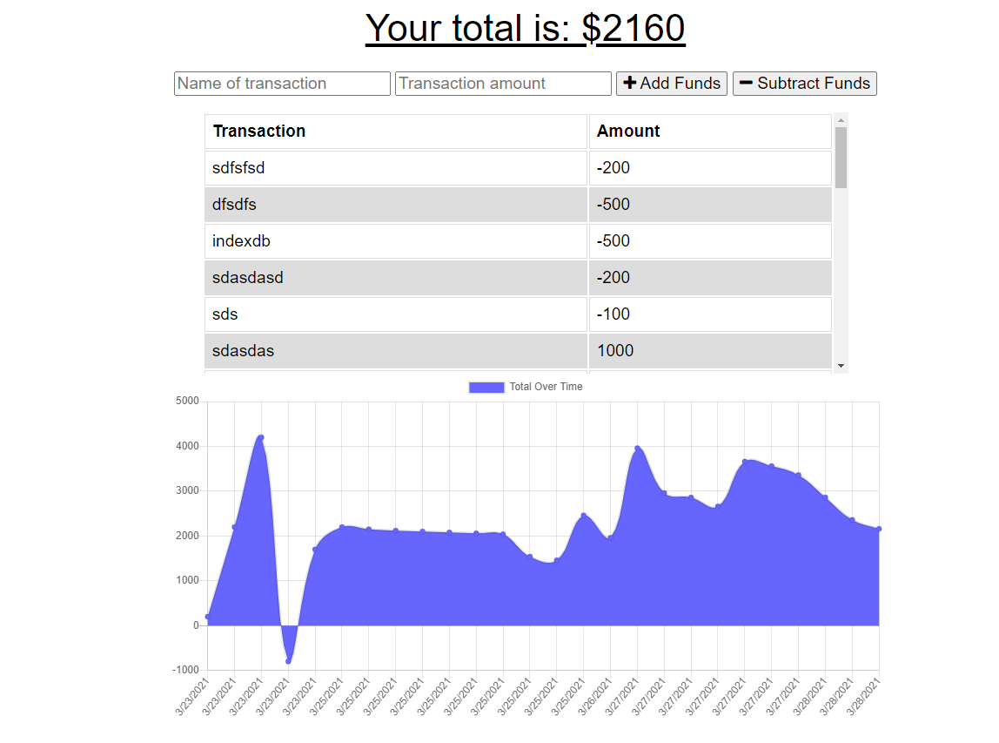

# budget-tracker
# Table of Contents
- [Description](#Description)
- [Technologies](#Technologies)
- [Installation](#Installation)
- [Deployment](#Deployment)
- [Screenshots](#Screenshots)
# Description
**budget-tracker** is a simple app which will alows user to input their transactions (either adding or subtracting fund from the budget)
and save those data in the database when user is connected to the internet. When user go offline and still have all the functionality to 
store user data in the brouser. 
And when user gets backs to online then app will brings all the data from the browser store **indexedDB** and it will store them back to the mongodb 
database.
# Technologies used
- node
- express 
- mongoDB
- mongoose
- morgan
- conpression
- heroku 
- Html/CSS
- Javascript
- mongodb atlas
# Installation 
clone the repo and run npm install on terminal.
# link to deployed app
[app](https://young-depths-32897.herokuapp.com/)
# Screenshots

